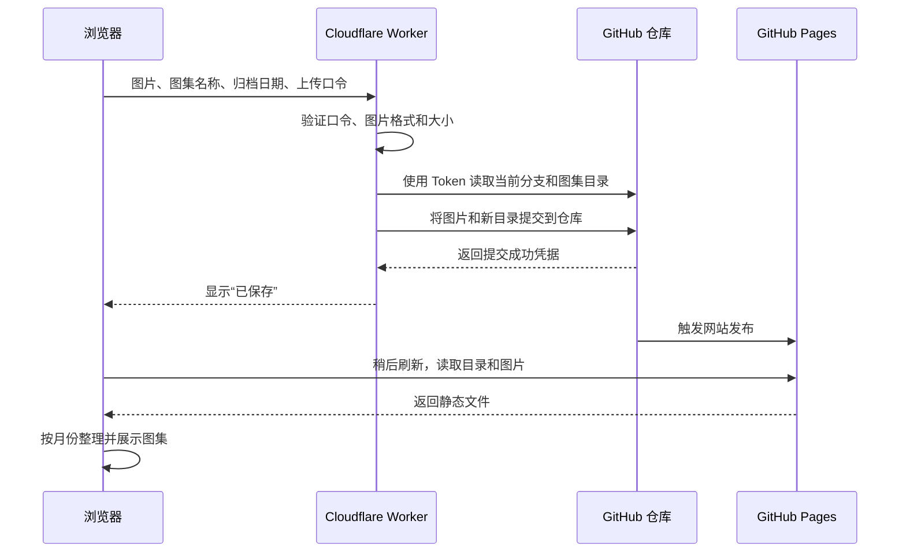

# 图集 · SherlockGy

一个适合知识图片的静态图集阅读器。部署在 <https://sherlockgy.github.io/>。

- 按归档日期的月份倒序展示，仅显示有内容的月份。
- 支持与时间无关的多层系列，例如“经济学 → 宏观经济学 → 货币政策 → 图集”。系列中的图集不进入月份归档。
- 每个图集可命名，包含一张或多张图片；首张图片作为封面。
- 发布时为现有和新增图集的每张本地图片生成 480 / 960 像素 WebP 缩略图，首页、编辑排序、逐页目录和放映目录按屏幕选图；阅读与下载保持使用原图。
- 支持搜索名称、说明和标签，筛选单张或多图。
- 首页备注保持单行截断，可直接复制完整备注；普通阅读可展开备注浮层，长内容限高滚动，复制按钮固定在上方。纯网址备注可直接打开，无备注时隐藏入口；全屏放映不展示备注。
- 支持逐页阅读、连续阅读、适屏、查看原图和复制当前页链接。两种阅读模式都按阅读框的宽度和高度等比例显示整张图片。逐页模式点手掌可拖动、滚轮或双指缩放（适屏大小的 25%–800%）；点“适屏”复位，关闭手掌也会恢复适屏居中。翻页复位图片并保留手掌模式；切换阅读模式关闭手掌。连续模式固定整图适配，不提供自由缩放。
- 阅读窗口默认居中；逐页和连续阅读的页码与跳转控件集中在底部，图片下方不再重复标号。“网页全屏”进入放映布局：左侧缩略图目录，右侧每次完整适屏显示一张图片，无顶部工具栏；单张与多张图集保持相同布局。浏览器地址栏和标签页保持可用。
- 普通逐页模式下，多图图集左侧显示独立滚动的缩略图目录，点击跳页，当前页高亮并跟随定位。目录内可用上下方向键切换图片，Tab 只停留在当前页；切换连续模式或关闭阅读窗口会释放目录图片，退出全屏后恢复当前页目录。单张图集不显示普通逐页目录。
- 放映时滚轮上下翻图；左侧小手开启后，可滚轮或双指缩放（适屏大小的 25%–800%），按住拖动查看，四周各允许半个观看区域的空白。关闭小手恢复适屏居中；切换图片会复位，但保留小手模式。点击当前目录项或在首尾继续翻页会保留查看位置。
- 普通逐页阅读和全屏放映在当前原图完成后，按顺序预载并解码后两张及前一张原图。仅保留当前及相邻三张的图片引用，离开该模式或关闭阅读窗口后释放；翻到已预载的图片时直接复用，跳到尚未预载的页面仍需等待加载。
- 连续阅读只加载当前页及前后各两页的原图，滚远后移除图片及其引用，返回时按需加载。所有页面保留固定高度的占位，加载与释放不会改变滚动位置；浏览器仍可自行保留网络缓存以加速回看。
- 逐页与全屏的手掌模式均支持加减键缩放、0 键恢复适屏；图片区域获得焦点时生效。窗口大小变化时按图片尺寸同步调整平移位置，保持正在查看的区域。
- 普通阅读和全屏放映的复位按钮始终显示“适屏”；当前缩放比例以只读百分比常显在工具区，适屏大小为 100%，与操作按钮分开。连续模式不显示缩放控件。
- 键盘：`←` / `→` 翻页，`Home` / `End` 首尾页，`Esc` 先退出网页全屏、再次按下返回图集，`/` 搜索。
- 添加图集支持日期、说明和图片排序；未配置上传服务时可本地预览，返回添加窗口可继续原草稿，预览不保存。
- 已有图集支持修改名称与说明、新增图片、排序和换图；一次保存全部生效。仅上传新增或替换的文件，单独修改名称或说明不上传图片。
- 首次上传与后续编辑都提供较大的排序预览图，点击“查看大图”可逐张查看、切换原尺寸；关闭大图后继续原草稿。已有缩略图按原图地址复用，缺少缩略图时按需加载原图；首次上传直接使用本地文件预览。
- 添加、编辑和系列操作弹窗中，顶部关闭区与底部操作区保持可见，中间内容独立滚动；编辑图集在载入成功后才显示保存区。长提示可独立滚动阅读。
- 新版上传按文件流水处理，默认两路并发；同一页面重试复用已成功图片，最后一次提交完整图集。
- 系列页面直接新建系列或子系列，对象旁的菜单支持重命名和移动，“调整顺序”只整理当前层级。侧栏支持展开与收起多层目录；月份图集与系列图集不能互相移动。
- 页面采用浅色界面和统一的 SVG 图标，仅显示自己的图集。

## 本地运行

无需安装依赖或编译，执行 `python3 -m http.server 8080`，访问 `http://localhost:8080`。需要通过 HTTP 服务打开，不能直接双击 HTML。Node 20+ 可运行 `npm test` 验证数据处理、放映缩放与拖动边界，以及模拟 GitHub 的保存流程。Worker 只允许正式站点的浏览器来源，本地预览不会直接取得线上编辑权限。

`tests/responsive.html` 为开发检查入口，可同时检查 390 px 和 320 px 的布局。

预览正式发布产物：先执行 `python3 -m pip install -r scripts/requirements.txt`，再执行 `python3 scripts/build_site.py` 和 `python3 -m http.server 8080 --directory _site`。Python 3.10+ 可执行 `python3 -m unittest discover -s tests -p 'test_*.py'` 检查构建、缓存、旧图补齐和换封面。

## 内容格式

维护 `data/albums.json`，将图片放入 `images/YYYY/MM/<album-id>/`。例如：

```json
{
  "schemaVersion": 1,
  "albums": [
    {
      "id": "my-first-album",
      "title": "我的第一份知识图集",
      "date": "2026-09-15",
      "description": "主题与出处，可留空",
      "tags": ["学习笔记"],
      "images": [
        {
          "src": "./images/2026/09/my-first-album/001.png",
          "alt": "图片内容的简要说明",
          "width": 1600,
          "height": 2200
        }
      ]
    }
  ]
}
```

`id` 须唯一，只使用英文字母、数字、下划线或连字符；日期为真实的 `YYYY-MM-DD`，按此字面日期归档，不进行时区换算。`images` 的数组顺序就是阅读顺序。可填写图片原始宽高；阅读器按当前阅读框自动适配，连续模式的图片框不依赖原图加载来确定高度。日期和图片顺序由上传者决定，系统不读取 EXIF 进行重排。

### 多层系列

同一份目录可以增加顶层 `series` 数组，每项包含 `id`、`title`、`parentId`；顶层系列的 `parentId` 为空字符串，下级系列指向上级编号。数组中同级条目的相对顺序就是展示顺序，最多支持 200 个系列，禁止循环引用。

图集通过 `seriesId` 指向所属系列。系列图集无需 `date`，不参与月份归档；`albums` 数组中同一系列图集的相对顺序就是阅读目录的顺序。一个系列可以同时包含下级系列和图集，页面先展示下级系列，再展示直属图集。搜索系列时会包含其下级系列中的图集。

旧目录没有 `series` 或 `seriesId` 时，保持原有月份归档。两类图集独立，网页与系列整理接口不提供互相转换。系列图集可以在系列之间移动，只修改归属，不移动或重新上传图片；已有日期保持原值，不参与系列展示。

### 在网页中管理

1. 进入“系列图集”后点击“新建系列”；进入某个系列后，可以“新建子系列”或“添加图集”。新增图集沿用当前页面的归属，系列图集不需要日期。
2. 系列卡片或当前系列标题下方的菜单提供“重命名”和“移动到…”。移动系列时，其子系列和图集一起移动，不能移到自身或下级系列。
3. 系列图集卡片的菜单提供“编辑图集”和“移动到…”，目标只能是已有系列。月份图集不出现在系列整理操作中。
4. 点击“调整顺序”，分别调整当前层级的子系列和直属图集；根页面只调整顶层系列。每次操作在对应窗口输入上传口令后保存，不需要单独进入全局管理界面。
5. 阅读已有图集时点击“编辑图集”，载入最新内容后可以修改名称与说明、新增、排序、换图。可以移除本次尚未保存的新图，或撤销本次换图。名称为 1–120 字，说明最多 10000 字、允许清空；修改名称或说明保持图集 ID、图片地址和分享链接。

图集编辑窗口先通过 Worker 载入最新内容。系列操作在保存时自动读取最新目录，仅应用本次操作，保留其他条目的变化；如果操作对象的名称、归属或待排序列表已发生冲突，会提示刷新后重新操作。关闭带有未保存修改的窗口会提示放弃草稿；口令不持久化。刷新页面仍会丢失草稿。

第一张图片作为封面，改变首张顺序会同时改变封面。分享链接继续按页码定位，因此重排后原链接可能指向另一张图片。换图使用新的文件地址，旧图片文件暂时保留，原图地址仍可能访问；本功能不执行图片删除或 Git 历史清理。

## 对接 Cloudflare Worker

`config.js` 已填写 Worker 的公开地址。将 [worker.js](worker/worker.js) 粘贴到 Cloudflare 编辑器，并按照 [部署说明](worker/SETUP.md) 设置两个 Secret。GitHub 凭据只能保存在 Worker 的 Secret 中，不能写入本仓库。Worker 需在你的 Cloudflare 账户中完成部署，前端才可以实际发布图集。

详见 [Worker 接口约定](docs/worker-api.md)。每个图集最多 30 张，单张 10 MiB，一次上传的文件合计 30 MiB。编辑时，合计大小只计算本次新增或替换的文件，排序不重新上传原图。支持 JPG、PNG、WebP、GIF、AVIF。

## 图片上传与展示原理

浏览器上传到 Worker，Worker 把图片和图集目录提交到 GitHub，GitHub Pages 再发布成网站。



详细的提速取舍、实现和失败边界见 [图片上传提速方案](docs/upload-performance.md)。

### 三个核心部分

1. **图片文件**
   - 实际存放在 GitHub 仓库，例如 `images/2026/09/<album-id>/001.png`。
   - 新建月份图集使用日期目录，新建系列图集使用 `images/series/<album-id>/`。新增或替换的文件名带请求编号，排序由目录中的图片列表决定，第一张作为封面。
2. **图集目录 `data/albums.json`**
   - 记录每个图集的名称、归档日期、说明和图片列表。
   - 网页读取这个文件，分别展示月份归档与系列层级；两者共用同一套图片阅读器。
   - 单图和多图使用相同结构，区别只是图片列表的长度。
3. **Worker 上传接口**
   - GitHub Token 保存在 Cloudflare Secret 中；浏览器提交独立的上传口令。
   - Worker 验证请求后，通过 GitHub Git Data API 创建图片文件、更新目录，并生成一次 Git 提交。长期文件存储由 GitHub 仓库承担。
   - 图片和目录一起更新到主分支；并发上传时检查冲突、重新读取目录并有限重试，保留其他图集及站点文件。

### 保存、发布与重试

- **“已保存”表示 GitHub 提交完成。** 图片和目录已写入仓库，网页显示提交成功。
- **网站更新需要等待 GitHub Pages 发布完成。** 发布存在延迟，稍后刷新网站即可读取新目录和图片。
- **同一份草稿重试会复用请求编号。** 如果提交成功但响应丢失，原页面原样重试可识别已有图集，避免重复创建。刷新页面会清空未提交的草稿，因此超时后应先确认仓库或网站是否已有该图集。
- **每次成功创建图集都会增加一条 Git 提交记录。** 后续可以据此查看变更或回退。
- **编辑冲突不会覆盖新内容。** 编辑图片时如果同一图集被其他窗口更新，保存返回冲突并保留草稿。系列操作遇到目录版本变化时可再次保存，重新读取并检查本次操作；操作对象发生冲突时需刷新页面重新操作。无关条目和并发图片修改会被保留。
- **编辑重试记录保留最近 50 次。** 同一请求原样重试不会重复写入；超过记录范围的旧请求会因版本不符被拒绝。

## 部署

GitHub Pages 发布来源应切换为 **GitHub Actions**，由 `.github/workflows/pages.yml` 测试、生成缩略图并发布 `_site`。首次构建会自动处理所有现有图集中的本地图片；以后上传、换图、排序触发的新提交也会自动处理。缩略图和补充后的目录仅进入网站发布产物，不写回源目录、不增加生成图片的 Git 提交。配置与回退步骤见 [缩略图发布说明](docs/thumbnails.md)。

写入仍由 Cloudflare Worker 处理。仓库版本为 `2026-09-19-series-1`：系列整理接口禁止两类图集互相转换，并保护月份图集的日期和相对顺序。名称与长说明编辑、排序时更新自动页码说明的能力保持可用。建议先部署 Worker，再发布新版前端；Secret 保持原值。更新仓库内的 Worker 文件不会自动部署 Cloudflare，详见 [部署说明](worker/SETUP.md)。不要把 GitHub 凭据放在前端；这是公开的个人图集站，发布的图片可被访问。

参考：[GitHub Pages 发布来源](https://docs.github.com/en/pages/getting-started-with-github-pages/configuring-a-publishing-source-for-your-github-pages-site)。
