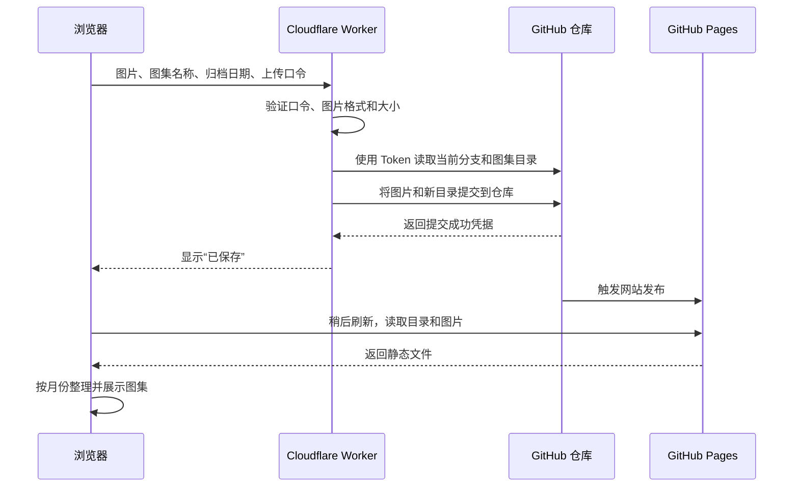

# 图集 · SherlockGy

一个适合知识图片的静态图集阅读器。部署在 <https://sherlockgy.github.io/>。

- 按归档日期的月份倒序展示，仅显示有内容的月份。
- 每个图集可命名，包含一张或多张图片；首张图片作为封面。
- 支持搜索名称、说明和标签，筛选单张或多图。
- 支持逐页阅读、连续阅读、放大、适宽、查看原图和复制当前页链接。
- 阅读窗口默认居中；“网页全屏”将阅读区铺满当前网页，浏览器地址栏和标签页保持可用。
- 键盘：`←` / `→` 翻页，`Home` / `End` 首尾页，`Esc` 先退出网页全屏、再次按下返回图集，`/` 搜索。
- 添加图集支持日期、说明和图片排序；未配置上传服务时可本地预览，预览不保存。
- 页面采用浅色界面和统一的 SVG 图标，仅显示自己的图集。

## 本地运行

无需安装依赖或编译，执行 `python3 -m http.server 8080`，访问 `http://localhost:8080`。需要通过 HTTP 服务打开，不能直接双击 HTML。Node 18+ 可运行 `npm test` 验证数据处理。

`tests/responsive.html` 为开发检查入口，可同时检查 390 px 和 320 px 的布局。

## 内容格式

维护 `data/albums.json`，将图片放入 `images/YYYY/MM/<album-id>/`。例如：

```json
{
  "schemaVersion": 1,
  "albums": [
    {
      "id": "my-first-album",
      "title": "我的第一份知识图集",
      "date": "2026-09-15",
      "description": "主题与出处，可留空",
      "tags": ["学习笔记"],
      "images": [
        {
          "src": "./images/2026/09/my-first-album/001.png",
          "alt": "图片内容的简要说明",
          "width": 1600,
          "height": 2200
        }
      ]
    }
  ]
}
```

`id` 须唯一，只使用英文字母、数字、下划线或连字符；日期为真实的 `YYYY-MM-DD`，按此字面日期归档，不进行时区换算。`images` 的数组顺序就是阅读顺序。建议填写图片宽高，减少连续阅读时的布局跳动。日期和图片顺序由上传者决定，系统不读取 EXIF 进行重排。

## 对接 Cloudflare Worker

`config.js` 已填写 Worker 的公开地址。将 [worker.js](worker/worker.js) 粘贴到 Cloudflare 编辑器，并按照 [部署说明](worker/SETUP.md) 设置两个 Secret。GitHub 凭据只能保存在 Worker 的 Secret 中，不能写入本仓库。Worker 需在你的 Cloudflare 账户中完成部署，前端才可以实际发布图集。

详见 [Worker 接口约定](docs/worker-api.md)。默认限制为 30 张、单张 10 MiB、合计 30 MiB；后端应实施相同或更严格的限制。支持 JPG、PNG、WebP、GIF、AVIF。

## 图片上传与展示原理

浏览器上传到 Worker，Worker 把图片和图集目录提交到 GitHub，GitHub Pages 再发布成网站。



### 三个核心部分

1. **图片文件**
   - 实际存放在 GitHub 仓库，例如 `images/2026/09/<album-id>/001.png`。
   - 一个图集对应一个目录，图片按上传者调整的顺序编号，第一张作为封面。
2. **图集目录 `data/albums.json`**
   - 记录每个图集的名称、归档日期、说明和图片列表。
   - 网页读取这个文件，根据归档日期按月份分组，只展示有图集的月份。
   - 单图和多图使用相同结构，区别只是图片列表的长度。
3. **Worker 上传接口**
   - GitHub Token 保存在 Cloudflare Secret 中；浏览器提交独立的上传口令。
   - Worker 验证请求后，通过 GitHub Git Data API 创建图片文件、更新目录，并生成一次 Git 提交。长期文件存储由 GitHub 仓库承担。
   - 图片和目录一起更新到主分支；并发上传时检查冲突、重新读取目录并有限重试，保留其他图集及站点文件。

### 保存、发布与重试

- **“已保存”表示 GitHub 提交完成。** 图片和目录已写入仓库，网页显示提交成功。
- **网站更新需要等待 GitHub Pages 发布完成。** 发布存在延迟，稍后刷新网站即可读取新目录和图片。
- **同一份草稿重试会复用请求编号。** 如果提交成功但响应丢失，原页面原样重试可识别已有图集，避免重复创建。刷新页面会清空未提交的草稿，因此超时后应先确认仓库或网站是否已有该图集。
- **每次成功创建图集都会增加一条 Git 提交记录。** 后续可以据此查看变更或回退。

## 部署

仓库根目录即发布目录，保留 `.nojekyll`。GitHub Pages 发布来源为 `master` 分支根目录，无需 npm 构建或专属后端。不要把 GitHub 凭据放在前端；这是公开的个人图集站，发布的图片可被访问。

参考：[GitHub Pages 发布来源](https://docs.github.com/en/pages/getting-started-with-github-pages/configuring-a-publishing-source-for-your-github-pages-site)。
