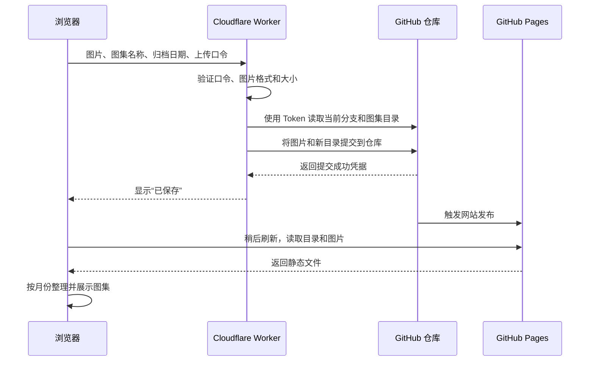

# 图集 · SherlockGy

一个适合知识图片的静态图集阅读器。部署在 <https://sherlockgy.github.io/>。

- 按归档日期的月份倒序展示，仅显示有内容的月份。
- 支持与时间无关的多层系列，例如“经济学 → 宏观经济学 → 货币政策 → 图集”。系列中的图集不进入月份归档。
- 每个图集可命名，包含一张或多张图片；首张图片作为封面。
- 支持搜索名称、说明和标签，筛选单张或多图。
- 支持逐页阅读、连续阅读、放大、适宽、查看原图和复制当前页链接。
- 阅读窗口默认居中；“网页全屏”进入放映布局：左侧缩略图目录，右侧每次完整适屏显示一张图片，无顶部工具栏。浏览器地址栏和标签页保持可用。
- 放映时滚轮上下翻图；左侧小手开启后，滚轮改为缩放（适屏大小的 25%–800%），按住拖动查看，四周各允许半个观看区域的空白。关闭小手恢复适屏居中；通过目录切图也会复位，但保留小手模式。
- 键盘：`←` / `→` 翻页，`Home` / `End` 首尾页，`Esc` 先退出网页全屏、再次按下返回图集，`/` 搜索。
- 添加图集支持日期、说明和图片排序；未配置上传服务时可本地预览，预览不保存。
- 已有图集支持新增图片、排序和换图；一次保存全部生效。仅上传新增或替换的文件。
- 系列管理支持新建、重命名、调整上级系列、同级排序，以及移动已有图集、调整系列内的图集顺序。
- 页面采用浅色界面和统一的 SVG 图标，仅显示自己的图集。

## 本地运行

无需安装依赖或编译，执行 `python3 -m http.server 8080`，访问 `http://localhost:8080`。需要通过 HTTP 服务打开，不能直接双击 HTML。Node 20+ 可运行 `npm test` 验证数据处理、放映缩放与拖动边界，以及模拟 GitHub 的保存流程。Worker 只允许正式站点的浏览器来源，本地预览不会直接取得线上编辑权限。

`tests/responsive.html` 为开发检查入口，可同时检查 390 px 和 320 px 的布局。

## 内容格式

维护 `data/albums.json`，将图片放入 `images/YYYY/MM/<album-id>/`。例如：

```json
{
  "schemaVersion": 1,
  "albums": [
    {
      "id": "my-first-album",
      "title": "我的第一份知识图集",
      "date": "2026-09-15",
      "description": "主题与出处，可留空",
      "tags": ["学习笔记"],
      "images": [
        {
          "src": "./images/2026/09/my-first-album/001.png",
          "alt": "图片内容的简要说明",
          "width": 1600,
          "height": 2200
        }
      ]
    }
  ]
}
```

`id` 须唯一，只使用英文字母、数字、下划线或连字符；日期为真实的 `YYYY-MM-DD`，按此字面日期归档，不进行时区换算。`images` 的数组顺序就是阅读顺序。建议填写图片宽高，减少连续阅读时的布局跳动。日期和图片顺序由上传者决定，系统不读取 EXIF 进行重排。

### 多层系列

同一份目录可以增加顶层 `series` 数组，每项包含 `id`、`title`、`parentId`；顶层系列的 `parentId` 为空字符串，下级系列指向上级编号。数组中同级条目的相对顺序就是展示顺序，最多支持 200 个系列，禁止循环引用。

图集通过 `seriesId` 指向所属系列。系列图集无需 `date`，不参与月份归档；`albums` 数组中同一系列图集的相对顺序就是阅读目录的顺序。一个系列可以同时包含下级系列和图集，页面先展示下级系列，再展示直属图集。搜索系列时会包含其下级系列中的图集。

旧目录没有 `series` 或 `seriesId` 时，保持原有月份归档。将已有图集移入系列只修改归属，不移动或重新上传图片；原日期保留以便以后移回月份归档。原本无日期的系列图集移回月份归档时，必须选择日期。

### 在网页中管理

1. 侧栏点击“管理”，输入现有上传口令，点击“载入最新内容”。
2. 通过“当前整理位置”切换层级，新建系列，修改名称、上级系列，或用“上移 / 下移”调整同级顺序。
3. 顶层管理位置也显示按月归档的图集，通过“图集归属”可将它们移入任何系列。进入某个系列后可以调整该系列内的图集顺序。
4. 点击“保存修改”。新图集在“添加图集”窗口选择所属系列即可；选择系列后不需要日期。
5. 阅读已有图集时点击“编辑图片”，载入最新内容后可以新增、排序、换图。可以移除本次尚未保存的新图，或撤销本次换图。

编辑窗口通过 Worker 读取仓库中的最新内容，避免 Pages 发布延迟导致使用旧版本。关闭带有未保存修改的窗口会提示放弃草稿；口令不持久化。刷新页面仍会丢失草稿。

第一张图片作为封面，改变首张顺序会同时改变封面。分享链接继续按页码定位，因此重排后原链接可能指向另一张图片。换图使用新的文件地址，旧图片文件暂时保留，原图地址仍可能访问；本功能不执行图片删除或 Git 历史清理。

## 对接 Cloudflare Worker

`config.js` 已填写 Worker 的公开地址。将 [worker.js](worker/worker.js) 粘贴到 Cloudflare 编辑器，并按照 [部署说明](worker/SETUP.md) 设置两个 Secret。GitHub 凭据只能保存在 Worker 的 Secret 中，不能写入本仓库。Worker 需在你的 Cloudflare 账户中完成部署，前端才可以实际发布图集。

详见 [Worker 接口约定](docs/worker-api.md)。每个图集最多 30 张，单张 10 MiB，一次上传的文件合计 30 MiB。编辑时，合计大小只计算本次新增或替换的文件，排序不重新上传原图。支持 JPG、PNG、WebP、GIF、AVIF。

## 图片上传与展示原理

浏览器上传到 Worker，Worker 把图片和图集目录提交到 GitHub，GitHub Pages 再发布成网站。



### 三个核心部分

1. **图片文件**
   - 实际存放在 GitHub 仓库，例如 `images/2026/09/<album-id>/001.png`。
   - 新建月份图集使用日期目录，新建系列图集使用 `images/series/<album-id>/`。新增或替换的文件名带请求编号，排序由目录中的图片列表决定，第一张作为封面。
2. **图集目录 `data/albums.json`**
   - 记录每个图集的名称、归档日期、说明和图片列表。
   - 网页读取这个文件，分别展示月份归档与系列层级；两者共用同一套图片阅读器。
   - 单图和多图使用相同结构，区别只是图片列表的长度。
3. **Worker 上传接口**
   - GitHub Token 保存在 Cloudflare Secret 中；浏览器提交独立的上传口令。
   - Worker 验证请求后，通过 GitHub Git Data API 创建图片文件、更新目录，并生成一次 Git 提交。长期文件存储由 GitHub 仓库承担。
   - 图片和目录一起更新到主分支；并发上传时检查冲突、重新读取目录并有限重试，保留其他图集及站点文件。

### 保存、发布与重试

- **“已保存”表示 GitHub 提交完成。** 图片和目录已写入仓库，网页显示提交成功。
- **网站更新需要等待 GitHub Pages 发布完成。** 发布存在延迟，稍后刷新网站即可读取新目录和图片。
- **同一份草稿重试会复用请求编号。** 如果提交成功但响应丢失，原页面原样重试可识别已有图集，避免重复创建。刷新页面会清空未提交的草稿，因此超时后应先确认仓库或网站是否已有该图集。
- **每次成功创建图集都会增加一条 Git 提交记录。** 后续可以据此查看变更或回退。
- **编辑冲突不会覆盖新内容。** 编辑图片时如果同一图集被其他窗口更新，保存返回冲突并保留草稿。整理系列时如果目录归属或顺序已改变，也需要重新载入；单纯的并发图片修改会被保留。
- **编辑重试记录保留最近 50 次。** 同一请求原样重试不会重复写入；超过记录范围的旧请求会因版本不符被拒绝。

## 部署

仓库根目录即发布目录，保留 `.nojekyll`。GitHub Pages 发布来源为 `master` 分支根目录，静态页面无需 npm 构建；写入由 Cloudflare Worker 处理。升级时先发布支持系列的前端，再部署新版 Worker，之后开始创建系列内容。更新仓库内的 Worker 文件不会自动部署 Cloudflare，详见 [部署说明](worker/SETUP.md)。不要把 GitHub 凭据放在前端；这是公开的个人图集站，发布的图片可被访问。

参考：[GitHub Pages 发布来源](https://docs.github.com/en/pages/getting-started-with-github-pages/configuring-a-publishing-source-for-your-github-pages-site)。
