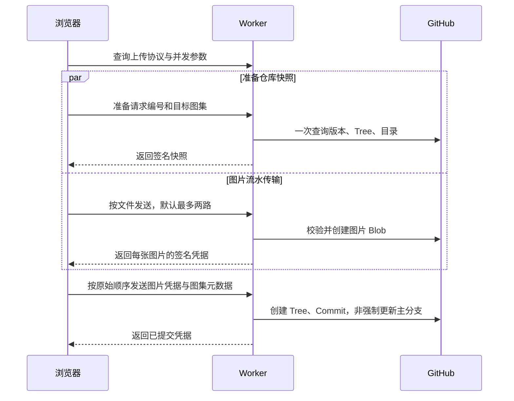

# 图片上传提速：方案与实现

## 目标与选择

优化从点击“保存”到 GitHub 主分支提交成功的时间，同时保持一个图集整批生效。GitHub Pages 发布时间单独计算。

当前图片仍保存为 GitHub 仓库文件，浏览器发送原始二进制，不改变尺寸、格式或图像质量。已有的排序、系列归属、并发编辑检查和目录格式继续使用。

| 路径 | 主要收益 | 成本与边界 | 本次决定 |
| --- | --- | --- | --- |
| 按文件流水上传、受控并发 | 浏览器传下一张时，Worker 可转存上一张；多个 Blob 请求重叠 | 带宽共享、内存和 GitHub 二级限流约束；并发数须可调 | 实现，默认 2 路 |
| 合并只读快照查询 | 分支 SHA、根 Tree、目录在一次 GraphQL 查询中取得 | 必须使用同一 Commit 下的目录，拒绝截断或部分结果 | 实现，提供 REST 兼容模式 |
| 查询与图片传输并行 | 仓库查询不占最终提交的等待路径 | 快照可能过时，最终必须非强制更新，冲突后重新读取 | 实现，使用签名快照 |
| GraphQL 整包写入 | 图片和目录可能一次调用即可提交 | 完整 Base64、较大内存峰值、未知的实际请求体边界；失败/冲突需要重传整包，不能引用已有 Blob SHA | 暂不接入生产路径，待真实负载对比 |
| 浏览器压缩图片 | 减少实际传输字节数 | 编码耗时可能抵消收益；知识图的小字、透明度、动画和原图保留需要明确产品规则 | 本次不自动压缩 |
| 原生 Git pack/push | 二进制打包，避免逐个 Blob API 和 Base64 | 需要新的 Git 执行/协议实现和运行部署方式 | 当前 Worker 项目不引入 |
| R2 直传 | 移除逐图 GitHub API 开销 | 改变存储架构及文件生命周期 | 不属于本次 GitHub 存图方案 |

这些优化中，流水传输、受控并发、只读查询合并及查询提前执行可以叠加。GraphQL 整包写入和 REST Blob 是替代写入路径，不先上传 Blob 再重复把图片塞入 GraphQL。

## 新链路

- 正常路径上传 N 张新图片：原实现 N+6 次 GitHub 请求，新实现 N+4 次。
  - 1 次 GraphQL 快照查询、N 次 Blob 创建、Tree/Commit/Ref 各 1 次。
  - `/health` 不访问 GitHub。分文件 HTTP 请求是浏览器与 Worker 的请求，不另增仓库读取。
  - 冲突、状态确认、快照过期会增加只读或最终提交请求。
  - `GITHUB_READ_MODE=rest` 时，快照恢复为 3 次读取，其中取得 HEAD 后的另外两次并行。
- 默认两个文件同时进行浏览器上传和 Worker 转存，合计在途原图字节最多 12 MiB；两个 10 MiB 文件会串行处理。
- 单图请求在 Worker 内只读取一次完整字节，随后验证文件头、计算 SHA-256、编码并上传。旧的 multipart 路径仍保留。
- 读取快照与图片传输同时开始，最终请求可直接使用已签名快照；不需要 KV、D1 或内存命中同一个 Worker isolate。
- 目前按文件流水处理，每个文件仍需完整接收后才能编码转存；没有声称同一张图片内部实现字节流透传。

## 完整性与中断

### 主分支更新边界

图片 Blob 和新 Commit 的创建不移动 `master`。只有全部图片凭据验证通过、图集目录完整组装后，才进行最后一次 Ref 更新。

- 请求中途失败：主分支仍为旧版本，可能留下未引用 Blob/Tree/Commit。
- 凭据按请求编号、目标接口、文件序号绑定。HMAC 覆盖 Blob SHA、内容哈希、类型、尺寸和字节数，防止客户端修改引用或绕过合计大小限制。
- 签名密钥同时依赖仅服务端持有的 GitHub Token 和上传口令；仅知道上传口令无法伪造图片凭据或仓库快照。
- 新建图集最多 30 张、每张 10 MiB、合计 30 MiB；编辑继续要求每张原图恰好保留或替换。
- 修改只使用新文件地址；重复上传同一请求按现有内容指纹识别。
- GitHub 返回乱序不会改变图片顺序，最终凭据按原始文件索引组装。
- 过时快照的提交受 `force: false` 保护，最多三轮提交尝试；重读后保留其他图集和文件的更新。相同图集的并发编辑继续返回 `ALBUM_CHANGED`。
- 未引用对象不会出现在主分支正常文件列表和历史中；本实现不承诺 GitHub 的回收时间，也不执行历史清理。

### 超时和重试

- 单图浏览器等待 90 秒，最终元数据提交等待 90 秒；GitHub 每步仍为 20 秒。整批不再共用 120 秒倒计时。
- 某张失败后停止调度新文件，等待已在途任务结束并保存其成功凭据，再向用户返回错误。
- 同一页面原样重试会复用已经成功的图片凭据。凭据有效期 24 小时，签名快照有效期 5 分钟；过期快照在服务端重新读取，过期图片需要重传。
- 最终提交网络失败、超时或响应不完整时，通过请求编号查询仓库；确认已提交就返回成功，不再传图或新增提交。
- 若提交结果仍无法确认，保留草稿；下一次保存先查询状态。不会在结果不明时切换到另一种写入协议。
- 草稿/凭据保存在当前页面内存中，刷新或关闭仍会丢失。刷新后的恢复和永久断点存储不属于本次实现。
- GitHub 429 或带限流头的 403 返回重试时间。浏览器停止本批后续调度并遵守等待时间，不自动连续重发大文件。

## 兼容、部署与回退

详见 [Worker 部署说明](../worker/SETUP.md)。

1. 推荐先部署 Worker，再合并/发布前端。
   - Worker 继续接受旧版 multipart 上传，旧前端可运行。
   - 新前端发现旧 Worker 没有 `signed-blobs-v1` 能力时，使用旧版上传路径。
2. 健康检查版本为 `2026-09-17-upload-pipeline-1`，并返回 `upload.protocol`。
3. `UPLOAD_CONCURRENCY` 可选值 1、2、3，默认 2；按真实限流、吞吐和 CPU/内存指标选择。
4. `GITHUB_READ_MODE=rest` 可绕开 GraphQL 读取问题，保留文件流水上传。
5. 改动 GitHub 中的 `worker.js` 不会自动部署 Cloudflare。回退 Worker 后，新前端会在能力缓存最长 60 秒过期后使用旧协议；进行中的草稿可以原样重试。
6. 轮换 GitHub Token 或上传口令会使旧签名凭据失效，需要重新选择图片/重建草稿。

## 验证及速度结论的边界

自动测试使用模拟 GitHub，覆盖新建/编辑、乱序完成、字节并发预算、签名校验、过期、部分失败复用、提交响应丢失、30 张限流配额、旧协议以及冲突保护。测试验证了传输与快照查询确实重叠，以及正常请求数为 N+4。

这些测试不等同于 Cloudflare 实际性能、账户额度或 GitHub 写权限验证。不能把并发 2 路表述为整体必然快两倍。

部署后用同一组真实图片测试 1、5、10 张和接近 30 MiB 的批次，分别记录：

- 从点击保存到返回 GitHub 提交成功的时间。
- 浏览器上传耗时、Worker 日志中 `github.success.elapsedMs`、Cloudflare CPU/内存指标。
- 并发 1、2、3 的总耗时、失败率和限流情况。
- GitHub Pages 发布等待单独记录，不并入上传吞吐。

若继续验证 GraphQL 整包写入，在独立测试仓库内对这些负载比较处理时间、请求体边界、Worker 内存、超时与冲突重发成本，再决定是否加入小批次专用路径；不在正式图集里创建测试内容。

## 参考

- [GitHub GraphQL Commit 与文件读取](https://docs.github.com/en/graphql/reference/commits)
- [GitHub GraphQL 文件变更参数](https://docs.github.com/en/graphql/reference/git#filechanges)
- [GitHub GraphQL 超时](https://docs.github.com/en/graphql/overview/rate-limits-and-query-limits-for-the-graphql-api#timeouts)
- [GitHub 非强制分支更新](https://docs.github.com/en/rest/git/refs#update-a-reference)
- [GitHub API 并发与限流建议](https://docs.github.com/en/rest/using-the-rest-api/best-practices-for-using-the-rest-api)
- [Cloudflare Workers 资源限制](https://developers.cloudflare.com/workers/platform/limits/)
